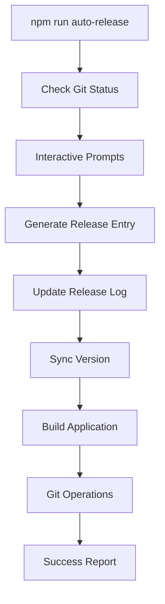

# Release Automation and Version Management

## Overview

SmartBack features a comprehensive automated release system that streamlines the entire release process from version management to deployment. The system handles version synchronization, release note generation, git operations, and build processes with a single command.

## Quick Start

### One-Command Release Automation

```bash
npm run auto-release
```

This single command handles the complete release workflow:
1. 📝 Interactive release note creation
2. 🔢 Automatic version increment
3. 🕐 Copenhagen timezone timestamps
4. 🔄 Version synchronization across files
5. 🏗️ Production build
6. 📤 Git commit and push
7. 🏷️ Git tag creation and push

### Quick Release Commands

```bash
# Quick patch release (bug fixes)
npm run patch

# Quick minor release (new features)  
npm run minor

# Quick major release (breaking changes)
npm run major
```

## Automated Release System Features

### 1. Interactive Release Creation

The system provides a guided, interactive experience:

```
🚀 SmartBack Release Automation Tool
=====================================
📦 Current version: 1.3.1

? What type of version increment? (Use arrow keys)
❯ patch (1.3.1 → 1.3.2) - Bug fixes and small improvements
  minor (1.3.1 → 1.4.0) - New features and enhancements
  major (1.3.1 → 2.0.0) - Breaking changes and major updates

? Enter release title: Critical Authentication Bug Fix

? Include "Added" section? (y/N) n
? Include "Changed" section? (y/N) n  
? Include "Fixed" section? (y/N) y

? Add item to "Fixed" section: Fixed authentication timeout issue
? Add another item to "Fixed" section? (y/N) y
? Add item to "Fixed" section: Resolved session persistence bug
? Add another item to "Fixed" section? (y/N) n
```

### 2. Intelligent Git Analysis

The system analyzes git changes to suggest appropriate release content:

```typescript
// Analyzes git changes and suggests release content
const analyzeGitChanges = async () => {
  const changedFiles = await exec('git diff --name-only HEAD~1');
  const suggestions = {
    title: generateTitle(changedFiles),
    sections: suggestSections(changedFiles),
    items: generateItems(changedFiles)
  };
  return suggestions;
};
```

### 3. Copenhagen Time Timestamps

Automatic timestamp generation in Copenhagen timezone:

```typescript
// Generates Copenhagen time (CET/CEST)
const getCopenhagenTime = () => {
  const now = new Date();
  const copenhagenTime = now.toLocaleString('sv-SE', {
    timeZone: 'Europe/Copenhagen',
    year: 'numeric',
    month: '2-digit',
    day: '2-digit',
    hour: '2-digit',
    minute: '2-digit',
    second: '2-digit'
  });
  
  return copenhagenTime.replace(' ', ' ');
};
```

### 4. Version Synchronization

Ensures version consistency across all files:

```bash
# Sync versions between package.json and release log
npm run sync-version
```

The sync process:
1. Reads latest version from `documentation/07-legacy/RELEASE_LOG.md`
2. Compares with current `package.json` version
3. Updates `package.json` if versions don't match
4. Reports synchronization status

## Release Process Workflow

### 1. Automated Workflow



### 2. Git Operations Sequence

```bash
# Automatic git operations
git add .
git commit -m "Release 1.3.2: Critical Authentication Bug Fix"
git push origin main
git tag v1.3.2
git push origin --tags
```

### 3. Build Integration

```bash
# Build process with version sync
npm run sync-version
npm run build
```

## Version Management

### 1. Semantic Versioning

SmartBack follows semantic versioning (SemVer):

#### Major Version (X.0.0)
- Breaking changes
- Major feature overhauls
- API incompatibilities
- Complete redesigns

#### Minor Version (1.X.0)
- New features
- Significant enhancements
- Non-breaking additions
- New functionality

#### Patch Version (1.2.X)
- Bug fixes
- Small improvements
- Security patches
- Performance optimizations

### 2. Multiple Releases Per Day

The system supports multiple releases per day with precise timestamps:

```markdown
## [1.3.2] - 2025-07-05 18:45:00
**Hotfix: Critical Bug Fix**
### Fixed
- Authentication timeout issue
- Session persistence bug

## [1.3.1] - 2025-07-05 16:22:00
**Version Management Enhancement**
### Added
- Automated version synchronization
- Multiple releases per day support

## [1.3.0] - 2025-07-05 09:35:00
**Collapsible Sidebar and Responsive Layout**
### Added
- Collapsible sidebar functionality
- Responsive layout improvements
```

### 3. Version Consistency Checks

```typescript
// Version consistency validation
const checkVersionConsistency = async () => {
  const packageVersion = require('./package.json').version;
  const releaseLogVersion = extractLatestVersion('./documentation/07-legacy/RELEASE_LOG.md');
  
  if (packageVersion !== releaseLogVersion) {
    console.warn(`Version mismatch: package.json (${packageVersion}) vs release log (${releaseLogVersion})`);
    return false;
  }
  
  return true;
};
```

## Release Log Format

### 1. Standard Format

```markdown
# Release Log

## [1.3.2] - 2025-07-05 18:45:00
**Release Title**

### Added
- New features and functionality

### Changed  
- Modifications to existing features

### Fixed
- Bug fixes and corrections

### Removed
- Deprecated features removed

## [Previous Version] - Date Time
...
```

### 2. Section Guidelines

#### Added Section
- New features
- New functionality
- New components
- New integrations

#### Changed Section
- Modifications to existing features
- UI/UX improvements
- Performance enhancements
- Behavior changes

#### Fixed Section
- Bug fixes
- Error corrections
- Security patches
- Performance fixes

#### Removed Section
- Deprecated features
- Removed functionality
- Cleanup items

## Error Handling and Validation

### 1. Pre-Release Validation

```bash
# Validation checks before release
- Working directory is clean
- All files committed
- Network connectivity
- Build success verification
```

### 2. Error Recovery

```typescript
const handleReleaseError = async (error) => {
  switch (error.type) {
    case 'BUILD_FAILURE':
      console.error('Build failed. Fix errors and try again.');
      break;
    case 'GIT_ERROR':
      console.error('Git operation failed. Check repository status.');
      await rollbackChanges();
      break;
    case 'NETWORK_ERROR':
      console.error('Network error. Check connectivity and retry.');
      break;
    default:
      console.error('Unknown error occurred:', error.message);
  }
};
```

### 3. Rollback Capabilities

```bash
# Automatic rollback on critical failures
git reset --hard HEAD~1  # Rollback commit
git tag -d v1.3.2        # Remove tag
git push --delete origin v1.3.2  # Remove remote tag
```

## Integration with Development Workflow

### 1. Development Commands

```bash
# Development workflow
npm run dev          # Development server
npm run build        # Production build
npm run test         # Run tests
npm run lint         # Code linting

# Release workflow
npm run sync-version # Sync versions only
npm run auto-release # Complete automated release
```

### 2. CI/CD Integration

```yaml
# Example GitHub Actions workflow
name: Automated Release
on:
  push:
    branches: [main]
jobs:
  release:
    runs-on: ubuntu-latest
    steps:
      - uses: actions/checkout@v2
      - name: Setup Node.js
        uses: actions/setup-node@v2
        with:
          node-version: '18'
      - name: Install dependencies
        run: npm install
      - name: Run automated release
        run: npm run auto-release -- --batch
```

### 3. Branch Strategy

```bash
# Recommended branch strategy
main          # Production releases
develop       # Development integration  
feature/*     # Feature branches
hotfix/*      # Emergency fixes
release/*     # Release preparation
```

## Advanced Features

### 1. Batch Mode

```bash
# Scripted releases for CI/CD
npm run auto-release -- --batch --type=patch --title="Automated Release"
```

### 2. Custom Templates

```typescript
// Release template configuration
const releaseTemplates = {
  hotfix: {
    title: 'Hotfix: {description}',
    sections: ['Fixed'],
    type: 'patch'
  },
  feature: {
    title: 'Feature: {description}',
    sections: ['Added', 'Changed'],
    type: 'minor'
  },
  breaking: {
    title: 'Breaking: {description}',
    sections: ['Added', 'Changed', 'Removed'],
    type: 'major'
  }
};
```

### 3. Release Analytics

```typescript
// Track release metrics
const releaseMetrics = {
  frequency: calculateReleaseFrequency(),
  size: analyzeReleaseSize(),
  type: categorizeReleaseType(),
  timeline: generateReleaseTimeline()
};
```

## Best Practices

### 1. Release Planning

- **Regular Releases**: Aim for consistent release schedules
- **Small Releases**: Frequent small releases over large ones
- **Clear Titles**: Descriptive release titles
- **Detailed Notes**: Comprehensive release documentation

### 2. Version Management

- **Consistent Versioning**: Follow semantic versioning strictly
- **Version Sync**: Always sync versions before release
- **Tag Management**: Use descriptive git tags
- **Branch Protection**: Protect main branch from direct pushes

### 3. Quality Assurance

- **Pre-Release Testing**: Test thoroughly before release
- **Build Verification**: Ensure successful builds
- **Rollback Preparation**: Have rollback plans ready
- **Documentation**: Keep release notes accurate and detailed

## Troubleshooting

### Common Issues

1. **Version Mismatch**
   ```bash
   npm run sync-version  # Fix version inconsistencies
   ```

2. **Build Failures**
   ```bash
   npm run build  # Test build before release
   ```

3. **Git Issues**
   ```bash
   git status      # Check working directory
   git clean -fd   # Clean untracked files
   ```

4. **Network Problems**
   ```bash
   git remote -v   # Verify remote configuration
   git push --dry-run  # Test push without changes
   ```

### Recovery Commands

```bash
# Emergency rollback
git reset --hard HEAD~1
git tag -d v1.3.2
git push --delete origin v1.3.2

# Fix version sync
npm run sync-version

# Force rebuild
npm run build --force
```

## Migration from Manual Process

### 1. Before (Manual Process)

```bash
# Manual steps (error-prone)
1. Edit RELEASE_LOG.md
2. Update package.json version
3. Build application
4. Git add, commit, push
5. Create and push tags
```

### 2. After (Automated Process)

```bash
# Single command
npm run auto-release
```

### 3. Benefits

- **Time Savings**: 5-minute process reduced to 30 seconds
- **Error Reduction**: Eliminates manual mistakes
- **Consistency**: Standardized release format
- **Reliability**: Atomic operations with rollback
- **Team Efficiency**: Same process for all developers

The SmartBack release automation system transforms the complex multi-step release process into a simple, guided experience that ensures consistency, reliability, and efficiency across all releases.
